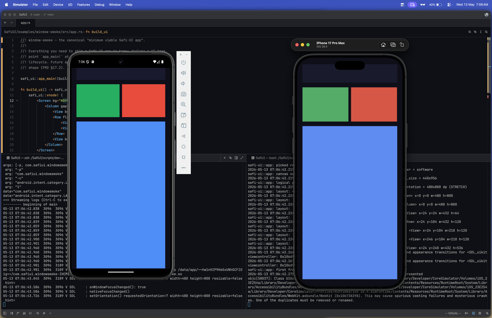

# Safi UI

[](https://github.com/Abdulkader-Safi/Safi-UI-Mobile/actions/workflows/ci.yml)
[](LICENSE)
[](SafiUI/rust-toolchain.toml)

> An open-source declarative XML-driven mobile UI framework built in pure Rust.




Write UI in XML. Render natively on Android and iOS. Zero managed runtime. Zero translation layers. Direct Vulkan on Android, direct Metal on iOS, both through SDL3's GPU API.

No Flutter. No React Native. No JVM, no Dart VM, no V8. Just native GPU performance from a single Rust codebase.

Built for engineers who want full control, game developers, embedded engineers, and Rust mobile developers who refuse to compromise on performance.

## What makes it different:

- **XML-driven declarative UI:** write layouts, not rendering code
- **Retained-mode dirty tracking:** GPU only wakes when something actually changed
- **Full component system:** 30+ built-in components + define your own in XML or Rust
- **CSS Flexbox layout via Taffy:** pure Rust, no Yoga dependency
- **Hot-reload in dev mode:** save your XML, see it instantly
- **Pure Rust:** no C runtime dependencies, no managed heap

The mobile UI layer that performance-critical apps have always needed.

GitHub coming soon. Follow along. 🚀

## Project layout

| Path      | Contents                                                                               |
| --------- | -------------------------------------------------------------------------------------- |
| `SafiUI/` | Cargo workspace: `safi-ui` library, `safi-ui-macros` proc-macros, `examples/*` (later) |
| `docs/`   | Rspress documentation site (`bun run dev` to preview, `bun run build` to ship)         |
| `todos/`  | Build plan as 35 numbered todos (`00`…`34`) derived from `PRD.md`                      |
| `PRD.md`  | Product requirements document, v2.3 — the source of truth for the spec                 |
| `LICENSE` | MIT                                                                                    |

## Quickstart

```bash
# Library workspace
cd SafiUI
cargo check --workspace
cargo clippy --workspace -- -D warnings
cargo fmt --check

# Docs site
cd docs
bun install
bun run dev
```

## Status

Pre-implementation. See [`docs/docs/status.md`](docs/docs/status.md) for the live progress tracker and [`PRD.md`](PRD.md) for the full spec.
